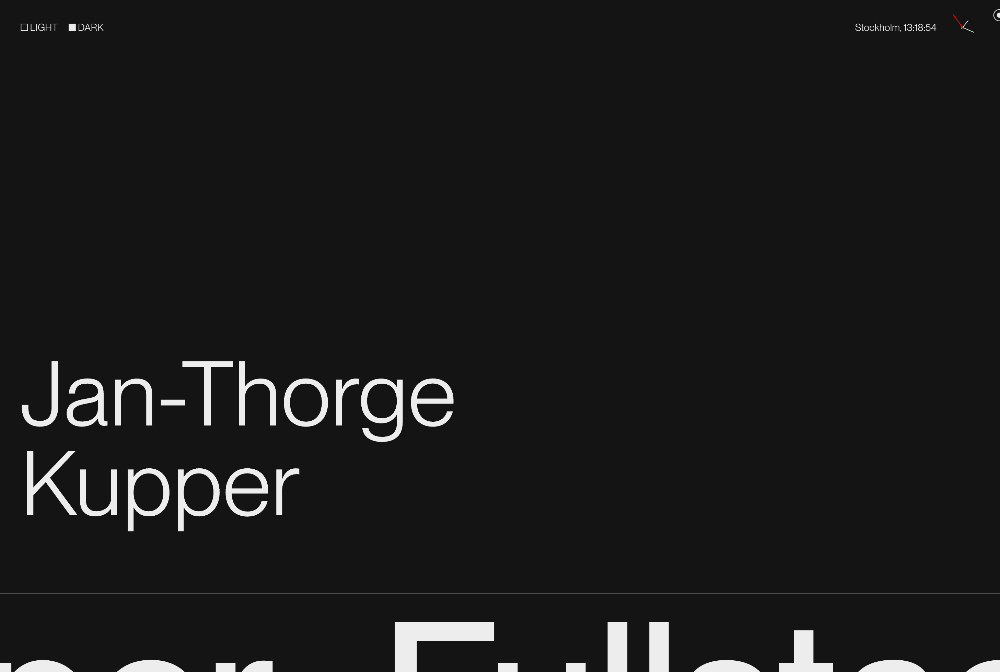

# Jan-Thorge Kupper - Portfolio Website

A modern, responsive portfolio website built with Next.js 15, React 19, and Tailwind CSS 4.

## Features

- **Modern Design** with light/dark mode support
- **Responsive Layout** optimized for all devices
- **Custom Animations** using Motion
- **Custom Cursor** for enhanced desktop experience
- **Contact Form** with email integration via Resend API

## Tech Stack

### Frontend

- Next.js 15
- React 19
- Tailwind CSS 4
- Motion for animations

### Backend

- Next.js App Router
- Resend API for email functionality

## Project Structure

- `app/`: Next.js app directory with page components and API routes
- `components/`: Reusable UI components
- `context/`: React context providers for state management
- `public/`: Static assets including images and fonts
- `util/`: Utility files for project and tech stack data

## Contact

Feel free to reach out to me on [LinkedIn](https://www.linkedin.com/in/jan-thorge-kupper/)
